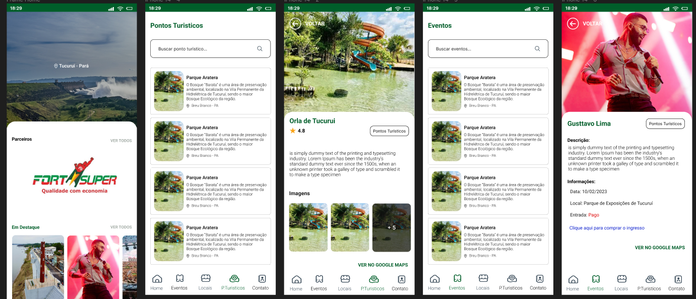

# TucGo - Guia Turistico


**Descrição:**
TucGo é o guia turístico definitivo da cidade de Tucurui-Pará ! Descubra os pontos turísticos mais icônicos, os eventos mais emocionantes e as atividades imperdíveis, tudo com a facilidade e praticidade do nosso aplicativo.

### Recursos Principais:

**Exploração de Pontos Turísticos**: Navegue por uma extensa lista de pontos turísticos e atrações imperdíveis da sua cidade. Obtenha informações detalhadas sobre cada local, incluindo descrições, fotos, horários de funcionamento e avaliações de outros usuários.

**Eventos em Destaque**: Fique atualizado com os principais eventos da cidade, desde festivais culturais e shows até exposições e eventos esportivos. O TucGo garante que você nunca perca uma oportunidade emocionante na sua cidade.

**Navegação Fácil**: Nosso aplicativo é projetado para uma experiência de usuário intuitiva. A navegação é simples e fácil de usar, permitindo que você encontre informações relevantes em apenas alguns toques.

**Mapa Interativo**: Utilize o mapa interativo integrado para visualizar a localização dos pontos turísticos e eventos em tempo real. Encontre a rota mais rápida e conveniente para chegar aos seus destinos atraves do google maps.

**Avaliações**: Compartilhe suas experiências e leia avaliações de outros usuários para descobrir quais são os locais mais populares e bem avaliados da cidade.

**Informações Práticas**: Encontre informações úteis, como horários de transporte público, opções de restaurantes nas proximidades e outras dicas para tornar sua visita à cidade mais agradável.

**TucGo** é o seu companheiro perfeito para desfrutar ao máximo da cidade, seja você um morador local ou um turista. Desvende os tesouros ocultos, participe de eventos emocionantes e crie memórias inesquecíveis com a facilidade deste aplicativo completo e amigável. Baixe o TucGo agora e comece a sua jornada pela cidade!

# TucGo
Aplicação completa do Guia Turistico da Cidade de Tucuruí.

- [Link Figma](https://www.figma.com/file/h3QaD3qpo2INaEkfqjY8Hh/Aplicativo-Guia-Tucuru%C3%AD?type=design&node-id=0-1&mode=design&t=KfpZ3SPooCja0wcD-0)




Execute o App:

```bash
yarn expo start --clear
```
## Stack

- React Native
- Typescript
- Storybook
- Expo Bare Workflow
- Cache Image
- Offline first
- Strapi as backend


